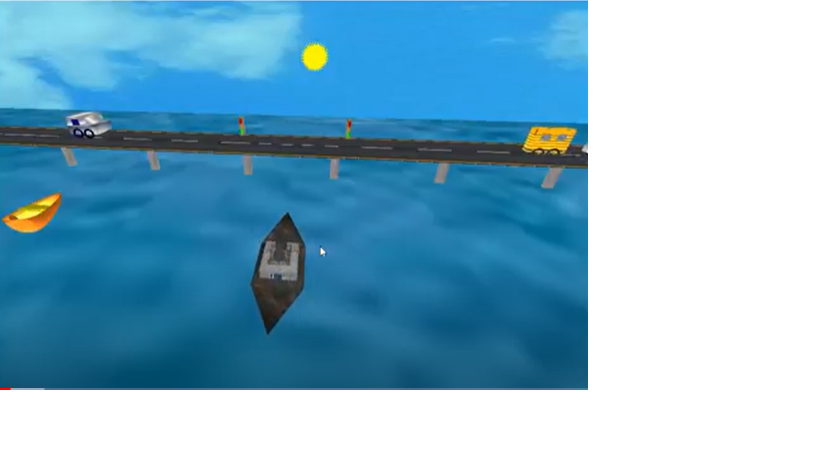

# Vertical Lift Bridge Simulator with Traffic and Lighting Control

This project simulates a vertical lift bridge that automatically opens and closes when a ship passes underneath. It also includes a traffic management system for vehicles with stoplights and multiple lighting modes.

  <!-- Replace this with an actual screenshot path if available -->

## Features

- **Automated Vertical Lift Bridge:** The bridge opens and closes when ships pass.
- **Traffic Light Management System:** Controls vehicle movement with stoplights.
- **Day/Night Modes:** Switch between day and night environments.
- **Custom Lighting Controls:** Control multiple lights, including ambient, diffuse, and specular lighting.
- **Camera and Viewpoint Control:** Allows camera zoom, movement, and focus on specific objects like vehicles and ships.

## Project Structure
```
VERTICAL BRIDGE/

│   │
│   ├── assets/              # Texture and image resources
│   │   ├── bus.bmp
│   │   ├── car_base.bmp
│   │   ├── car_base.jpg
│   │   ├── car_top.bmp
│   │   ├── funnel1.bmp
│   │   ├── iron.bmp
│   │   ├── piller.bmp
│   │   ├── road.bmp
│   │   ├── sea.bmp
│   │   ├── sky.bmp
│   │   ├── top.bmp
│   │   ├── upper_base.bmp
│   │   ├── wheel.bmp
│   │   ├── window.bmp
│   │   └── wood.bmp
│   │
│   ├── include/            # Header files
│   │   └── BmpLoader.h
│   │
│   ├── obj/               
│   │   └── Debug/
│   │       └── 160710_Vertical lift bridge with tr...
│   │
│   ├── project_files/      
│   │   ├── 160710_Vertical lift bridge with tr...
│   │   ├── 160710_Vertical lift bridge with tr...
│   │   ├── 160710.layout
│   │   ├── 160710.depend
│   │   ├── Texture.layout
│   │   └── Texture.depend
│   │
│   ├── src/               # Source files
│   │   ├── BmpLoader.cpp
│   │   └── main.cpp
│   │
│   └── README.md
```

## Controls

### Animation Controls
- **Start/Stop Animation:** Press `a`
- **Night Mode:** Press `d`
- **Day Mode:** Press `D`
- **Wired Mode:** Press `w`

### Vehicle Controls
#### Boat Controls
- **Forward:** Press `q`
- **Backward:** Press `Q`

#### Ship Controls
- **Forward:** Press `i`
- **Backward:** Press `m`
- **Right:** Press `l`
- **Left:** Press `j`

### Focus Controls
- **Focus on Ship:** Press `z` (Reset: `Z`)
- **Focus on Vehicles:** Press `x` (Reset: `X`)
- **Focus on Boat:** Press `c` (Reset: `X`)

### Lighting System
#### Main Lights
- **Light 1:** Press `1`
- **Light 2:** Press `2`
- **Lights 3 & 4:** Press `]`

#### Light 1 Properties
- **Ambient:** Press `3`
- **Diffuse:** Press `4`
- **Specular:** Press `5`

#### Light 2 Properties
- **Ambient:** Press `6`
- **Diffuse:** Press `7`
- **Specular:** Press `8`

#### Lights 3 & 4 Properties
- **Ambient:** Press `9`
- **Diffuse:** Press `0`
- **Specular:** Press `[`

### Camera Controls
#### Movement
- **Zoom:** Press `-` (in) or `+` (out)
- **Right/Left:** Press `p`/`o`
- **Up/Down:** Press `u`/`y`

#### Reference Point Adjustment
- **X-axis:** Press `P` (positive) or `O` (negative)
- **Y-axis:** Press `Y` (positive) or `U` (negative)
- **Z-axis:** Press `r` (positive) or `t` (negative)

## Installation

### Prerequisites
- OpenGL
- GLUT

### Build Instructions
1. Clone the repository:
   ```bash
   git clone https://github.com/yourusername/VerticalBridgeSimulator.git
   ```
2. Navigate to the project directory:
   ```bash
   cd VerticalBridgeSimulator
   ```
3. Open the project in your preferred IDE (e.g., Code::Blocks) or build using the command line
4. Build and run the executable

## User Manual
For detailed usage instructions, refer to the Controls section above. Each control is categorized based on its functionality for easy reference.

## Video Demo
Watch our [Vertical Bridge Simulator Demo](https://drive.google.com/file/d/1pwgJGdcyfXJVYrbuJ8ycufdqwl5YfFFW/view?usp=sharing) to see the project in action.

## License
[Include your license information here]
